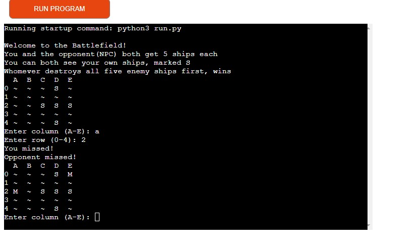
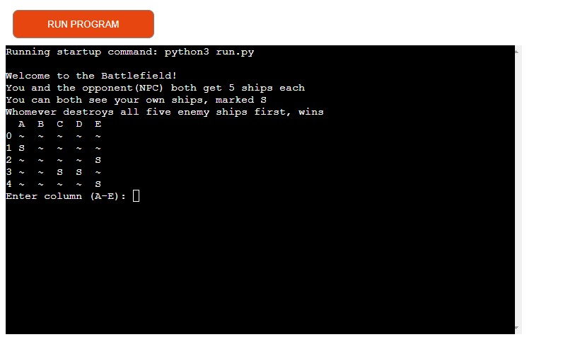

# Super Battleship Mania

## Desc

This is a simple game of Battleships created using Python, you play against an NPC
that makes random guesses, just like you. Who ever sinks all five of the enemy's ship first wins.

## How To Play

- click [this](https://pp-3lucas-ab3a595ba6a2.herokuapp.com/) link and you will be taken directly to the game, no strings attached
- Once you are there, you will see a 5x5 board with five 'S' on it, these 'S' symbolizes ships and can only be seen by you
- The goal is simple, locate and destroy the opponents ships one by one, you will take turn
- The ultimate champion is the one who succeds first

## Features

- Ships are randomly placed on the combined board
- After each guess the attempts will be printed
- Input validation, you can't enter any invalid or already guessed information

## Data Model

Standard Board 2D model, the game creates a 5x5 board for the two players to share
The game uses a lot of the try mechanism to figure out what's going on, personally I think
it's a great way to approach this sort of game.

## Testing

Passed it through a PEP8 with no appearant issues
Given a ton of invalid inputs such as strings where integers were expected
and also made repeated guesses.

## Bugs

There are none

## Deployment

It was deployed using Code Institutes mock terminal for Heroku
In order to deploy, I did the following

- Cloned this repository
- Create a new Heroku app
- Set the buildpacks to Heroku/Python and Heroku/Nodejs in that exact order
- Link the app to the repository
- Click Deploy

## Credits

- Code Institute for Template and mock terminal
- My most amazing buddy Mikke for the countless amount of explaining(Mentoring/tutoring me a little bit)
- OpenAI for when Mikke is sleeping. Mostly validation, tutoring and tips
